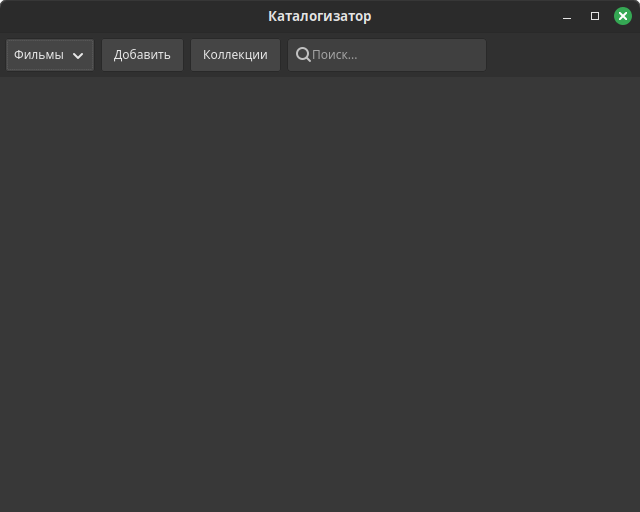

# Каталогизатор

Простой и универсальный каталогизатор для ведения коллекций.

1. Создание коллекций.
2. Добавление записей в коллекцию.
3. Установка статусов для записей.
4. Создание тематических подборок.

# Концепция

Запись имеет простую структуру: заголовок + содержание. Содержание формируется из разметки Markdown. Несколько служебных атрибутов: дата создания, изображение/превью, признак удаления, признак архивации. Для каждой коллекции можно задать набор статусов, например, для фильмов можно сделать "просмотрено" и "буду смотреть".

Записи объединяются в коллекции. Запись может быть только в одной коллекции, она определяет тип записи. В коллекции можно создать группы и включить в них записи этой коллекции. Группа представляет собой некую тематическую подборку.

# Зависимости

- Rust v1.88
- SQLite v3.50
- GTK v4.18
- Pango v1.56

# Внешний вид

