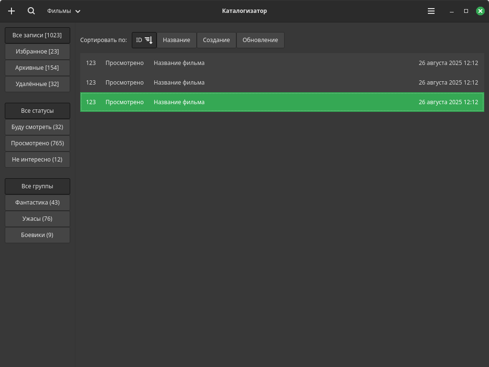

# Каталогизатор

Простой и универсальный каталогизатор для ведения коллекций.

1. Создание коллекций.
2. Добавление записей в коллекцию.
3. Установка статусов для записей.
4. Группировка записей по темам / рубрикам / категориям.

# Концепция

Запись имеет простую структуру: заголовок + содержание. Содержание формируется из разметки Markdown. Несколько служебных атрибутов: дата создания, дата последнего обновления, изображение/превью. Запись может иметь отметки об архивации, об удалении (корзина) и о нахождении в избранном. Для каждой коллекции задаётся свой набор статусов и свой набор групп.

Записи объединяются в коллекции. Запись может быть только в одной коллекции, она определяет тип записи. В коллекции можно создать группы и включить в них записи этой коллекции. Группа представляет собой некую тематическую подборку.

# Зависимости

- Rust v1.88
- SQLite v3.50
- GTK v4.18
- Pango v1.56

# Внешний вид

